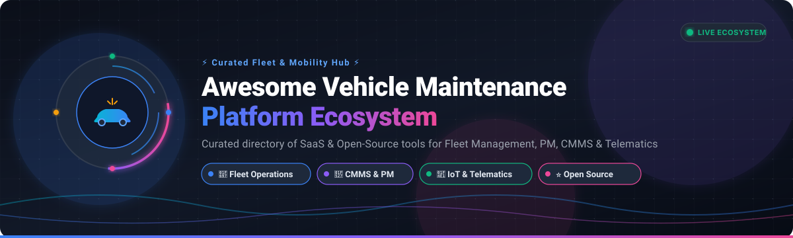

# 🚗 Awesome Vehicle Maintenance Platform Ecosystem 🛠️

<p align="center">
  
</p>

<p align="center">
  <a href="https://github.com/ishandutta2007/Awesome-Awesome-Awesome"></a><a href="https://discord.gg/jc4xtF58Ve"></a>
  <a href="https://github.com/ishandutta2007/Awesome-Vehicle-Maintenance-Platform/stargazers"></a>
  <a href="https://github.com/ishandutta2007/Awesome-Vehicle-Maintenance-Platform/network"></a>
  <a href="https://github.com/ishandutta2007/Awesome-Vehicle-Maintenance-Platform/blob/main/LICENSE"></a>
  <a href="https://github.com/ishandutta2007/Awesome-Vehicle-Maintenance-Platform/pulls"></a>
  <a href="https://github.com/ishandutta2007"></a>
</p>

---

### 🌐 Curated Directory of SaaS Products & Open-Source Software for Modern Fleet Management
**Focus Areas:** *Fleet Maintenance Management, Preventive Maintenance (PM), Work Orders, Digital Vehicle Inspections (DVIR), CMMS, Telematics, Fuel Tracking, Parts Inventory, OBD-II/CAN Bus Diagnostics & Complete Vehicle Lifecycle Management.*

📅 **Last updated:** August 2026

---

## 📖 Overview & SEO Summary

This repository tracks top **SaaS/hosted commercial platforms** and **self-hostable open-source projects** for **Vehicle Maintenance Management**, **Fleet Operations**, **Computerized Maintenance Management Systems (CMMS)**, **Predictive Maintenance**, **Digital Inspections**, **Work Orders**, **Spare Parts Inventory**, **Fuel Economy Logging**, and **Total Cost of Ownership (TCO)**.

These systems empower fleet managers, mechanics, logistics operators, municipalities, transport companies, and developers to oversee vehicles and equipment from initial procurement and onboarding through preventive servicing, defect resolution, compliance, and end-of-life disposal.

### 🔍 Key Capabilities Evaluated
- 🛠️ **Preventive Maintenance (PM):** Time-, mileage-, engine-hour-, and condition-triggered service intervals.
- 📋 **Digital Inspections & DVIR:** Custom electronic pre-trip and post-trip safety checklists with defect routing.
- ⚡ **Work Order Automation:** Automated technician assignment, labor tracking, parts reservation, and sign-offs.
- 📦 **Parts & Inventory Control:** Stock level tracking, purchase orders, reorder thresholds, and vendor logs.
- ⛽ **Fuel & Cost Tracking:** Transaction imports, MPG / L/100km analysis, cost-per-mile benchmarks, and TCO.
- 📡 **Telematics & Diagnostics:** GPS tracking, OBD-II / J1939 fault codes, geofencing, and driver behavior analytics.

---

## 📑 Table of Contents

- [🏢 SaaS / Hosted Commercial Platforms](#-saas--hosted-commercial-platforms)
- [⭐ Open-Source GitHub Projects](#-open-source-github-projects)
  - [🚀 Full Fleet Maintenance & Vehicle Management Platforms](#-full-fleet-maintenance--vehicle-management-platforms)
  - [📱 Vehicle Maintenance Loggers & Fuel Trackers](#-vehicle-maintenance-loggers--fuel-trackers)
  - [📡 Vehicle Telematics, GPS Tracking & OBD Data](#-vehicle-telematics-gps-tracking--obd-data)
  - [🌐 IoT, Edge Computing & Telemetry Automation](#-iot-edge-computing--telemetry-automation)
  - [🏢 CMMS, Asset Management & ERP Foundations](#-cmms-asset-management--erp-foundations)
  - [📊 Analytics, Time-Series & Visualization](#-analytics-time-series--visualization)
- [🏗️ Recommended Open-Source Vehicle Maintenance Architecture](#️-recommended-open-source-vehicle-maintenance-architecture)
- [🧱 Open-Source Fleet Lifecycle Data Model](#-open-source-fleet-lifecycle-data-model)
- [📈 Star History](#-star-history)
- [🤝 How to Contribute](#-how-to-contribute)
- [⚠️ Disclaimer](#️-disclaimer)

---

## 🏢 SaaS / Hosted Commercial Platforms

*Commercial enterprise and cloud fleet maintenance platforms ranked in **descending order by company scale (market valuation / parent company market cap / annual revenue)**.*

| Platform | Scale / Valuation / Revenue | Description / Focus | Starting Pricing | Free Tier / Free Trial Limits |
| :--- | :--- | :--- | :--- | :--- |
| **[Verizon Connect](https://www.verizonconnect.com/)** | **~$170B+ Market Cap** (Parent: Verizon Communications / ~$134B Revenue) | Enterprise fleet management and connected telematics platform supporting GPS vehicle tracking, maintenance alerts, digital DVIR inspections, and driver workflows. | **~$20–$30 / vehicle / month** (Reveal Starter plan; typically 36-month contract) | No permanent free tier; **30-day pilot / trial** available upon request with hardware shipment |
| **[AssetWorks Fleet](https://www.assetworks.com/)** | **~$60B+ Market Cap** (Parent: Constellation Software / ~$8.4B Revenue) | Enterprise fleet management ecosystem designed for government, public sector, transit, education, and heavy commercial fleets, covering lifecycle, work orders, fuel, and compliance. | **~$3,000 / month** base contract benchmark (~$36,000–$50,000/year enterprise deployment) | No permanent free tier; **Guided product demo & custom pilot** available upon request (no self-serve free trial) |
| **[Fiix](https://www.fiixsoftware.com/)** | **~$30B+ Market Cap** (Parent: Rockwell Automation / ~$8.5B Revenue; Acquired for ~$300M+) | Cloud CMMS platform supporting preventive, corrective, and condition-based maintenance, work orders, asset lifecycle tracking, parts inventory, and maintenance intelligence. | **$45 / user / month** (Basic tier billed annually) | **Free Forever plan** (up to 3 users, max 25 active PM tasks, ~20 tracked assets; community support only) |
| **[Samsara Fleet](https://www.samsara.com/)** | **~$22.8B+ Market Cap** (NYSE: IOT / ~$1.62B Annual Revenue) | Connected Operations Cloud combining vehicle telematics, real-time diagnostics, electronic inspections, automated maintenance workflows, and AI safety cameras. | **~$27–$33 / vehicle / month** (Software subscription; ~$99–$148 gateway hardware; 3-year contract) | **30-day free trial** (includes hardware evaluation with risk-free return window; no permanent free tier) |
| **[MaintainX Fleet](https://www.getmaintainx.com/industries/fleet-management)** | **~$3.6B Valuation** (Acquired by Autodesk in 2026 / ~$135M+ ARR) | Mobile-first fleet CMMS platform providing work orders, meter-based preventive maintenance triggers, asset health history, inspections, and parts inventory control. | **$20 / user / month** (Essential tier billed annually; $25/mo monthly; free unlimited requesters) | **Free Forever plan** (Basic tier: unlimited work orders, up to 2 active repeating PMs, 1-month analytics) or **30-day free trial** on paid tiers |
| **[Geotab](https://www.geotab.com/)** | **~$3B+ Valuation** (Unicorn / ~$1.0B+ ARR / 6M+ connected vehicles) | Global telematics and connected vehicle ecosystem providing engine diagnostics, maintenance insights, predictive maintenance rules, and driver management. | **~$30–$50 / vehicle / month** (Software + GO hardware bundle via authorized resellers) | **30-day hardware pilot / demo kit** available via authorized resellers (no self-serve free trial or permanent free tier) |
| **[Motive](https://gomotive.com/)** | **~$2.9B Valuation** (~$501M ARR / 100k+ customers) | Integrated fleet operations platform combining AI dashcams, telematics, automated maintenance workflows, driver safety coaching, and ELD compliance. | **~$25 / vehicle / month** (Base software subscription; 12-month minimum; hardware gateway separate) | **Free Driver App & Workforce Management (WFM) tier** for basic logging; **Interactive demo / pilot** on request |
| **[Fleetio](https://www.fleetio.com/)** | **~$1.5B+ Valuation** (Unicorn / ~$75M+ ARR / $624M funding) | Comprehensive cloud fleet management and maintenance system covering vehicles, preventive maintenance, inspections, work orders, service history, parts, and fuel. | **$4 / vehicle / month** (Essential tier billed annually; $5/mo monthly; 5-vehicle minimum) | **14-day free trial** (full access, no credit card required; no permanent free tier) |
| **[ManagerPlus](https://managerplus.com/)** | **~$1B+ Valuation** (Parent: Eptura / ~$100M+ ARR) | Asset and maintenance management platform providing PM scheduling, work orders, inspection tracking, parts inventory, and mixed-fleet lifecycle history. | **$85 / user / month** (Lightning Plus tier billed annually; free unlimited work requesters) | **14-day free trial / guided pilot** available upon request (no permanent free tier) |
| **[Limble CMMS](https://limblecmms.com/)** | **~$450M Valuation** (~$40M+ ARR / $113M total funding) | Cloud CMMS engineered for preventive maintenance, work orders, asset health, digital checklists, spare parts management, and fleet maintenance analytics. | **$28 / user / month** (Standard tier billed annually; free unlimited work requesters) | **14-day free trial** (full feature access, no credit card required; no permanent free tier) |
| **[Fleet Complete](https://www.fleetcomplete.com/)** | **~$450M Market Cap** (Parent: Powerfleet / ~$300M Annual Revenue) | Connected fleet and asset management platform offering vehicle GPS tracking, maintenance alerts, driver management, and connected IoT sensors. | **~$20–$45 / vehicle / month** (Base tracking and maintenance packages) | No permanent free tier; **Guided live demo & evaluation pilot** available upon request (no self-serve free trial) |
| **[UpKeep](https://www.onupkeep.com/)** | **~$258M Valuation** (~$25M+ ARR / $48M+ funding) | Mobile-first CMMS platform for work orders, preventive maintenance schedules, asset tracking, inventory costing, time tracking, and fleet upkeep workflows. | **$24 / user / month** (Essential tier billed annually; free unlimited view-only/requester users) | **7-day free trial** (full feature access, no credit card required; no permanent free tier) |
| **[Whip Around](https://whiparound.com/)** | **~$100M+ Valuation** (Acquired by Accel-KKR in 2026 / ~$10M+ ARR) | Cloud fleet inspection and maintenance platform focused on digital DVIR checklists, defect tracking, work orders, compliance, and asset tracking. | **$5 / asset / month** (Standard tier billed annually) | **Free Forever plan** (Basic tier: limited to 1 asset and 1 user) or **7-day free trial** for Pro tier (no credit card required) |
| **[Chevin FleetWave](https://www.chevinfleet.com/)** | **~$20M+ Revenue** (Parent: Jonas Software / Constellation Software) | Enterprise fleet management software covering vehicle lifecycle, workshop operations, compliance, driver management, fuel, and cost analytics. | **$3.00–$5.00 / vehicle / month** (FleetWave Core tier; additional assets at ~$0.50/month) | **14-day free trial** available upon request (no credit card required; no permanent free tier) |
| **[AUTOsist](https://autosist.com/)** | **~$15M–$25M Valuation** (~$5M Annual Recurring Revenue) | Cloud fleet maintenance platform covering preventive maintenance, custom digital inspections, service records, work orders, fuel, inventory, and documents. | **$6 / vehicle / month** (Maintenance package billed annually; 5-vehicle minimum) | **14-day free trial** (full feature access, no credit card required; no permanent free tier) |
| **[RTA Fleet](https://www.rtafleet.com/)** | **~$15M–$20M Valuation** (~$5M Annual Recurring Revenue) | Dedicated fleet management and workshop software covering preventive maintenance schedules, work orders, parts inventory, fuel, labor, and asset history. | **$6 / asset / month** (Pro tier billed annually; 100-asset minimum, includes unlimited users) | No permanent free tier; **Custom live demo & pilot program** available upon request (no self-serve free trial) |
| **[Fleet Maintenance Pro](https://www.fleetmaintenancepro.com/)** | **~$5M–$8M Revenue** (Innovative Maintenance Systems - IMS) | Fleet maintenance software focused on preventive maintenance tracking, automated work orders, repair history, parts, labor, and fleet cost reporting. | **$30–$35 / user / month** (Cloud tier) or **$649 one-time** perpetual desktop license | **30-day free trial** (full evaluation access for desktop or cloud; no permanent free tier) |
| **[Simply Fleet](https://www.simplyfleet.app/)** | **~$3M–$5M Valuation** (~$1.5M Annual Recurring Revenue) | Lightweight fleet maintenance app for vehicle tracking, preventive maintenance, digital inspections, service history, expenses, and document management. | **$2 / vehicle / month** (Essential tier billed annually at $20/vehicle/year) | **Free Forever plan** (up to 5 vehicles and 3 users) or **14-day free trial** for paid tiers (no credit card required) |

---

## ⭐ Open-Source GitHub Projects

*Every repository includes a live social star badge linking directly to its GitHub stargazers page. Sorted by star count in descending order within each category.*

### 🚀 Full Fleet Maintenance & Vehicle Management Platforms

* **[frappe/erpnext](https://github.com/frappe/erpnext)** [](https://github.com/frappe/erpnext/stargazers)
  **Comprehensive open-source ERP with built-in Vehicle & Fleet Management.**
  Full-featured ERP solution with comprehensive vehicle master records, fuel logging, maintenance tracking, insurance/registration logs, expense claims, driver assignments, and integrated accounting. Licensed under GPL-3.0.

* **[hargata/lubelog](https://github.com/hargata/lubelog)** [](https://github.com/hargata/lubelog/stargazers)
  **Modern self-hosted vehicle maintenance, service records & fuel economy logger.**
  Popular, self-hosted web application for tracking vehicle repairs, service intervals, maintenance reminders, fuel mileage (MPG/L100km), EV energy consumption, and document receipts. Available via Docker and community app stores. Licensed under MIT.

* **[fleetbase/fleetbase](https://github.com/fleetbase/fleetbase)** [](https://github.com/fleetbase/fleetbase/stargazers)
  **Open-source logistics, routing & fleet management infrastructure.**
  Modular logistics and transport management platform providing the foundational core for vehicle fleets, real-time driver tracking, transport orders, dispatch, and custom workflow automations. Licensed under MIT.

* **[mikaelacaron/Basic-Car-Maintenance](https://github.com/mikaelacaron/Basic-Car-Maintenance)** [](https://github.com/mikaelacaron/Basic-Car-Maintenance/stargazers)
  **Open-source iOS application for tracking personal vehicle maintenance.**
  Clean, beginner-friendly Swift/iOS app designed for logging maintenance events, service records, and scheduled vehicle checkups. Licensed under Apache-2.0.

* **[dannymcc/may](https://github.com/dannymcc/may)** [](https://github.com/dannymcc/may/stargazers)
  **Self-hosted multi-vehicle fuel and maintenance expense dashboard.**
  Clean web dashboard for logging vehicle fuel fill-ups, calculating mileage efficiency, and archiving maintenance receipts across multiple vehicles and drivers. Licensed under MIT.

* **[awslabs/aws-fleet-predictive-maintenance](https://github.com/awslabs/aws-fleet-predictive-maintenance)** [](https://github.com/awslabs/aws-fleet-predictive-maintenance/stargazers)
  **Predictive maintenance pipeline for commercial vehicle fleets.**
  Reference architecture from AWS Labs using machine learning and vehicle sensor telemetry to forecast remaining useful life (RUL) and detect impending component failures. Licensed under Apache-2.0.

* **[OCA/fleet](https://github.com/OCA/fleet)** [](https://github.com/OCA/fleet/stargazers)
  **Odoo Community Association (OCA) Fleet Management Suite.**
  Collection of modular open-source extensions for Odoo extending vehicle tracking, fuel logs, maintenance contracts, odometer checks, and driver assignments. Licensed under AGPL-3.0.

* **[autodo-app/autodo](https://github.com/autodo-app/autodo)** [](https://github.com/autodo-app/autodo/stargazers)
  **Flexible ToDo & preventive maintenance scheduler for vehicles.**
  Intuitive task and reminder management app dedicated to tracking automotive maintenance schedules, fluid changes, and repair intervals. Licensed under MIT.

* **[neuharthr/Fleetco](https://github.com/neuharthr/Fleetco)** [](https://github.com/neuharthr/Fleetco/stargazers)
  **Web-based fleet maintenance system with PHP and MySQL.**
  Lightweight fleet maintenance platform supporting vehicle records, service logs, work orders, and maintenance scheduling for smaller fleets. Licensed under GPL-2.0.

* **[abhishekpatel946/Smart-Vehicle-Fleet-Manager](https://github.com/abhishekpatel946/Smart-Vehicle-Fleet-Manager)** [](https://github.com/abhishekpatel946/Smart-Vehicle-Fleet-Manager/stargazers)
  **Smart vehicle fleet manager with maintenance and fuel monitoring.**
  Application tracking vehicle speeding, fuel refills, maintenance schedules, accident alerts, and telemetry reporting through charts and interactive dashboards.

* **[jmnda-dev/fleetms](https://github.com/jmnda-dev/fleetms)** [](https://github.com/jmnda-dev/fleetms/stargazers)
  **Dedicated open-source fleet maintenance & management platform.**
  Modern AGPL-3.0 fleet maintenance software covering vehicles, digital inspections, defects, service groups, maintenance reminders, work orders, parts inventory, and fuel logging.

* **[nelsonmpanju/Fleet-Management-System](https://github.com/nelsonmpanju/Fleet-Management-System)** [](https://github.com/nelsonmpanju/Fleet-Management-System/stargazers)
  **Open-source ERPNext/Frappe fleet management extension.**
  Comprehensive fleet platform built for the Frappe/ERPNext ecosystem. Handles vehicle profiles, trips, cargo, fuel logs, breakdown events, maintenance workflows, and financial records. Licensed under GPL-3.0.

* **[fleetbase/fleetops](https://github.com/fleetbase/fleetops)** [](https://github.com/fleetbase/fleetops/stargazers)
  **Fleet operations and maintenance layer extension.**
  Extends Fleetbase with vehicle maintenance history, work orders, preventive maintenance scheduling, parts, warranties, and telematics device connectivity. Licensed under MIT.

* **[SuyashT0911/Fleet-management-system-](https://github.com/SuyashT0911/Fleet-management-system-)** [](https://github.com/SuyashT0911/Fleet-management-system-/stargazers)
  **Full-stack Java & React fleet management application.**
  Reference architecture covering vehicles, drivers, trips, maintenance logs, fuel tracking, and analytics dashboards with a Java backend and React frontend.

* **[warrengalyen/OpenFleet](https://github.com/warrengalyen/OpenFleet)** [](https://github.com/warrengalyen/OpenFleet/stargazers)
  **Enterprise open-source fleet maintenance system built with .NET 8 & React.**
  Full-stack platform providing vehicle master data, work orders, digital inspections, preventive maintenance, spare parts inventory, vendor management, and audit logging.

* **[pablonortiz/vehicle-manager](https://github.com/pablonortiz/vehicle-manager)** [](https://github.com/pablonortiz/vehicle-manager/stargazers)
  **Cross-platform Flutter application for vehicle maintenance management.**
  Mobile and desktop app for logging vehicles, inspections, mileage, insurance renewals, service history, invoices, and photo records. Licensed under MIT.

* **[tolgatasci/fleet-management-system](https://github.com/tolgatasci/fleet-management-system)** [](https://github.com/tolgatasci/fleet-management-system/stargazers)
  **Laravel & Vue fleet management system.**
  System covering vehicles, maintenance records, digital inspections, work orders, drivers, real-time GPS tracking, and operational reporting.

* **[navodya0/FMS](https://github.com/navodya0/FMS)** [](https://github.com/navodya0/FMS/stargazers)
  **Laravel fleet management system.**
  Clean Laravel-based system focused on vehicle management, periodic inspections, rentals, and maintenance workflows.

---

### 📡 Vehicle Telematics, GPS Tracking & OBD Data

* **[teslamate-org/teslamate](https://github.com/teslamate-org/teslamate)** [](https://github.com/teslamate-org/teslamate/stargazers)
  **Self-hosted telemetry, efficiency & battery health logger for electric vehicles.**
  Popular self-hosted data logger written in Elixir. Records driving efficiency, charging history, battery degradation, tire wear reminders, and maintenance logs into PostgreSQL/Grafana. Licensed under MIT.

* **[traccar/traccar](https://github.com/traccar/traccar)** [](https://github.com/traccar/traccar/stargazers)
  **Industry-standard open-source GPS tracking server.**
  Enterprise-grade GPS tracking platform supporting 200+ communication protocols and thousands of GPS/OBD hardware models. Streams live vehicle locations, speed, fuel sensor data, and CAN bus telemetry. Licensed under Apache-2.0.

* **[traccar/traccar-web](https://github.com/traccar/traccar-web)** [](https://github.com/traccar/traccar-web/stargazers)
  **Modern React web frontend for Traccar GPS server.**
  Official modern web interface for Traccar featuring live map tracking, geofencing, route playback, driver dispatch, and vehicle telemetry reports. Licensed under Apache-2.0.

* **[owntracks/recorder](https://github.com/owntracks/recorder)** [](https://github.com/owntracks/recorder/stargazers)
  **Lightweight private location tracking backend.**
  Self-hosted server to store and visualize location data published by mobile devices and vehicle tracking beacons via MQTT or HTTP. Licensed under GPL-2.0.

---

### 🌐 IoT, Edge Computing & Telemetry Automation

* **[node-red/node-red](https://github.com/node-red/node-red)** [](https://github.com/node-red/node-red/stargazers)
  **Low-code flow-based integration platform for IoT and vehicle hardware.**
  Connects OBD-II scanners, GPS hardware, MQTT brokers, REST APIs, databases, and maintenance work order pipelines through visual flow-based programming. Licensed under Apache-2.0.

* **[thingsboard/thingsboard](https://github.com/thingsboard/thingsboard)** [](https://github.com/thingsboard/thingsboard/stargazers)
  **Open-source IoT platform for vehicle telemetry and diagnostics.**
  High-scalability IoT platform for collecting CAN bus and sensor telemetry, building fleet dashboard widgets, processing alarm thresholds, and triggering automated maintenance webhooks. Licensed under Apache-2.0.

* **[eclipse-mosquitto/mosquitto](https://github.com/eclipse-mosquitto/mosquitto)** [](https://github.com/eclipse-mosquitto/mosquitto/stargazers)
  **Lightweight MQTT messaging broker.**
  High-performance MQTT broker engineered to route real-time telemetry from connected vehicles and in-vehicle IoT hardware to backend servers. Licensed under EPL-2.0.

* **[eclipse-kura/kura](https://github.com/eclipse-kura/kura)** [](https://github.com/eclipse-kura/kura/stargazers)
  **Open-source IoT edge computing framework for telematics gateways.**
  Java/OSGi-based edge framework for vehicle-mounted gateways to read CAN bus, process OBD diagnostics locally, and transmit telemetry securely. Licensed under EPL-2.0.

---

### 🏢 CMMS, Asset Management & ERP Foundations

* **[snipe/snipe-it](https://github.com/snipe/snipe-it)** [](https://github.com/snipe/snipe-it/stargazers)
  **Open-source asset management system.**
  Widely used asset management software with robust check-in/check-out, driver assignments, QR code generation, license tracking, warranty dates, and audit history. Licensed under AGPL-3.0.

* **[frappe/frappe](https://github.com/frappe/frappe)** [](https://github.com/frappe/frappe/stargazers)
  **Full-stack Python & JS web framework for enterprise fleet apps.**
  Provides built-in role-based permissions, automated REST APIs, background job queues, workflows, document attachments, and reporting for custom fleet apps. Licensed under MIT.

* **[glpi-project/glpi](https://github.com/glpi-project/glpi)** [](https://github.com/glpi-project/glpi/stargazers)
  **Open-source IT & physical asset management and service desk.**
  Full-featured ticket, work order, contract, and asset management platform adaptable for workshop job cards and maintenance tracking. Licensed under GPL-3.0.

---

### 📊 Analytics, Time-Series & Visualization

* **[grafana/grafana](https://github.com/grafana/grafana)** [](https://github.com/grafana/grafana/stargazers)
  **Open and composable observability and fleet metrics dashboard.**
  Industry-leading platform for visualizing fleet health metrics, downtime, maintenance KPIs, fuel consumption curves, and real-time engine telemetry. Licensed under AGPL-3.0.

* **[postgres/postgres](https://github.com/postgres/postgres)** [](https://github.com/postgres/postgres/stargazers)
  **World's most advanced open-source relational database.**
  The gold-standard database engine for fleet master data, work orders, audit trails, and geospatial vehicle tracking queries with PostGIS. Licensed under PostgreSQL License.

* **[influxdata/influxdb](https://github.com/influxdata/influxdb)** [](https://github.com/influxdata/influxdb/stargazers)
  **High-performance time-series database.**
  Engineered for storing high-frequency sensor telemetry, OBD speed/RPM logs, GPS coordinates, and temperature readouts from vehicle sensors. Licensed under MIT.

---

## 🏗️ Recommended Open-Source Vehicle Maintenance Architecture

To build a **fully open-source, vendor-independent alternative** to commercial platforms like Fleetio, Samsara, MaintainX, or Whip Around, consider the following architecture:

```text
┌─────────────────────────────────────────────────────────────────────────────┐
│                       🖥️ Web & Mobile Frontend                             │
│       OpenFleet UI / LubeLogger / FleetMS / Traccar Web / Grafana           │
└──────────────────────────────────────┬──────────────────────────────────────┘
                                       │ REST / GraphQL / WebSockets
┌──────────────────────────────────────▼──────────────────────────────────────┐
│                    🚗 Core Fleet Maintenance Layer                         │
│  • Vehicle Profiles & Specs      • Preventive Maintenance (PM) Engine       │
│  • Digital DVIR Inspections      • Work Order Management & Job Cards        │
│  • Spare Parts & Stock Levels    • Labor Hours & Repair Invoices            │
│  • Fuel & Charging Logs          • Total Cost of Ownership (TCO)            │
│                  (OpenFleet / FleetMS / Fleetbase FleetOps)                 │
└───────────────────┬─────────────────────────────────────┬───────────────────┘
                    │                                     │
┌───────────────────▼───────────────┐     ┌───────────────▼───────────────────┐
│     📡 Telematics & Tracking      │     │       🏢 Enterprise Core          │
│  • GPS Real-Time Positioning      │     │  • Accounting & Cost Centers      │
│  • OBD-II / J1939 Engine Codes    │     │  • Procurement & Purchase Orders  │
│  • Geofencing & Odometer Sync     │     │  • Driver HR & Payroll Records    │
│  • Speed & Harsh Braking Alerts   │     │  • Compliance & Insurance Docs    │
│        (Traccar / TeslaMate)      │     │        (ERPNext / Frappe)         │
└───────────────────┬───────────────┘     └───────────────┬───────────────────┘
                    │                                     │
┌───────────────────▼─────────────────────────────────────▼───────────────────┐
│                       ⚡ IoT & Event Integration Hub                        │
│             Node-RED (Workflows) + Eclipse Mosquitto (MQTT)                 │
└──────────────────────────────────────┬──────────────────────────────────────┘
                                       │
┌──────────────────────────────────────▼──────────────────────────────────────┐
│                        💾 Data & Analytics Layer                            │
│  • Relational Store: PostgreSQL + PostGIS                                   │
│  • Time-Series Telemetry: InfluxDB                                          │
│  • Visual Dashboards: Grafana                                               │
└─────────────────────────────────────────────────────────────────────────────┘
```

---

## 🧱 Open-Source Fleet Lifecycle Data Model

```text
Vehicle (Master Asset)
 ├── 📄 Documentation (Registration, Title, Insurance, Warranty, Leases)
 ├── 👤 Driver & Operator Assignment History
 ├── ⏱️ Usage Meters (Odometer, Engine Hours, EV Battery Health / SoC)
 ├── 📋 Digital Inspections & DVIR
 │    └── ⚠️ Defect Logs (Pass/Fail Checks, Photos, Severity Ratings)
 │         └── 🛠️ Work Orders (Job Cards)
 │              ├── 👨‍🔧 Assigned Technician & Labor Hours
 │              ├── 📦 Parts Requisition & Inventory Deductions
 │              ├── 🏢 External Service Vendor & Invoices
 │              └── 💵 Total Maintenance Cost
 ├── 📅 Preventive Maintenance (PM) Plans (Interval triggers: Time / Odometer / Hours)
 ├── ⛽ Fuel & Charging Logs (Gallons/Litres, Fuel Card Receipts, MPG Efficiency)
 ├── 📡 Live Telematics & OBD-II Fault Codes (DTC Codes, Location, Speed, Idle Time)
 └── 📊 Comprehensive Lifecycle Audit Trail (Procurement → Maintenance → Disposal)
```

---

## 📈 Star History

[](https://star-history.dera.page/#ishandutta2007/Awesome-Vehicle-Maintenance-Platform&type=date&legend=top-left)

---

## 🤝 How to Contribute

1. 🍴 **Fork the repository**.
2. 🌿 Create a new feature branch (`git checkout -b feature/new-entry`).
3. 📝 Add or update entries following the table/badge format.
4. ⭐ Include: Name, official/GitHub link, live star badge (`style=social&color=white`), and an objective 1–2 sentence description.
5. 🚀 Submit a Pull Request with a clear summary of additions.

Contributions and community suggestions are always welcome! ⭐ **Star this repository** if you find it helpful.

---

## ⚠️ Disclaimer

- This is a **community-curated** educational directory — not an endorsement of any listed service.
- Commercial fleet management software often bundles proprietary hardware, cellular data SIMs, ELD compliance, and managed telematics.
- Open-source tools vary in maturity; always audit code, security postures, backup mechanisms, and protocol support before production deployments.
- Telematics data (GPS coordinates, driver tracking, and OBD metrics) carries privacy and regulatory responsibilities.

---

<p align="center">
  <b>Built for Fleet Managers, Workshop Technicians, Mechanics, Logistics Operators, Developers, and Mobility Enthusiasts.</b><br/>
  <i>Let's make vehicle maintenance more open, transparent, self-hostable, and data-driven.</i>
</p>
